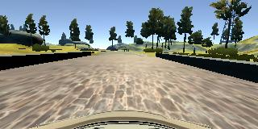
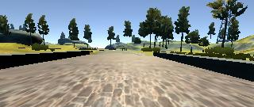
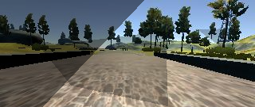
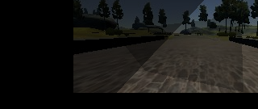
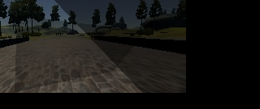
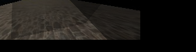
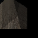
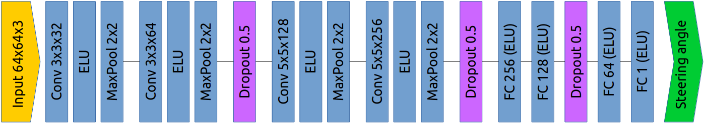

# Behavioral Cloning

## Udacity Self-Driving Car Nanodegree Project 3

In this project, a Deep Neural Network is trained to clone a human driving behavior in order to control a car in a Simulator.
We have to create our own training data by recording our driving style using the Simulator.
We can then train a Deep Neural Network to learn to drive and validate it in the autonomous mode of the Simulator.
It is a rewarding project as you see the car driving by itself around the track.


## Install

If you want to see how it is working, you will need to install the Simulator as well as some Python libraries and cloning this repository.

Download the simulator based on your OS.
- [Linux](https://d17h27t6h515a5.cloudfront.net/topher/2016/November/5831f0f7_simulator-linux/simulator-linux.zip)
- [macOS](https://d17h27t6h515a5.cloudfront.net/topher/2016/November/5831f290_simulator-macos/simulator-macos.zip)
- [Windows 32-bit](https://d17h27t6h515a5.cloudfront.net/topher/2016/November/5831f4b6_simulator-windows-32/simulator-windows-32.zip)
- [Windows 64-bit](https://d17h27t6h515a5.cloudfront.net/topher/2016/November/5831f3a4_simulator-windows-64/simulator-windows-64.zip)


**Python 3.5** is required with the following libraries installed:

- Numpy
- TensorFlow
- Keras
- OpenCV
- Eventlet
- SocketIO
- Pillow

## Training Data

To collect training data you need to execute the Simulator in **Training Mode** and click on the record button.
The recording will generate two things :
1. `IMG` folder - Contains all the frames of your recording for the 3 cameras ( left, center, right ).
2. `driving_log.csv` - Telemetry data ( steering angle, throttle, brake, speed ) and the frames associated.

## Data Augmentation

In order to get a robust Network that can generalize well, we need to generate data from our training set.
This is more a base of images to generate training data on the fly. We can't in our training set create all possible situation and the 1st track of the simulator is fairly simple with few turns, no slope, and well illuminated.

Our network need to extract feature from many situations. So in order to reflect as much as possible the complex reality of driving, i have created the following pipeline.
 
| Pipeline |
| :-------: |
| Training Image => Crop car hood => Add shadow cast and occlusion => Adjust luminosity => Translation => Flip => Crop sky => Normalize & Resize|


**1. Training images:**

An image is randomly selected from our recorded data.
I only use the image from the center camera.

  

**2. Crop car hood:**

I crop the car hood at the bottom as this is not a feature that we want the network use.
Also as we need to move the image around to generate additional data, we can't have the car hood off center, so those images would be useless. We crop the bottom 25 pixels.

  

**3. Shadow cast and occlusion:**

The idea here is to generate Shadow cast from potential objects that can exist in the real world.
This is to force the network to learn redundancy and extract feature from partial information.

Randomly objects are generated up to 5, they all have a random size and transparency:
  - Triangle from any size
  - Circle located anywhere but with a radius up to `height // 6`
  - 4 sides polygon with every corner restricted in a fourth of the image
  - Occlusion generated by a big patch avoiding the center bottom of the image

  

**4. Luminosity:**

Randomly update the luminosity of the images to simulate day/night/over exposition from a factor of 0.25 to 1.25.

  

**5. Translation:**

Translate images randomly on both direction.

  - Vertically to simulate slope
  - Horizontally to simulate different position of the car on the street.
  In that case we adjust the steering angle based on the translation factor.
  I use 0.006 factor by pixel translated. I used the fact that if we translate the image by half and that the car was centered, we need to steer at the maximum which is 1 so `1.0/160 ~ 0.006`


  

**6. Flip:**

Images are randomly flipped Vertically and steering angle reversed.
This is to generate more left/right turns and to get data from both side of the street.

  

**7. Crop sky:**

Sky is cropped from the images as there is no valuable information.
We need the network to concentrate on the important features.

  

**8. Normalize & Resize:**

Images are normalized in the range [0.0-1.0] to reduce the standard deviation.
They are as well zero mean centered to improve the gradient descent of the learning process.

Images are resized to 64x64 so the network can be smaller and faster to train.
Based on my experiment bigger size did not improve the results.

  


## Architecture

The final architecture is a LeNet like with a stack a convolution/pooling modules followed by a stack of fully connected layers.

I tried different other known networks (VGG16, InceptionV3) and use feature extraction + fine tuning the top layers.
But even though i was able to train them on AWS, i had never been able to run it on my computer to try them in the Simulator.
My computer has such low memory on the graphic card that i can't even load the network in it.
So i used a smaller network that can be executed on my configuration.


The input size of the network is an image of 64x64x3.

We have then 4 convolution modules that consist of the following:

- A convolution layer of 3x3 or 5x5, depth increasing from 32 to 256
- An activation layer using ELU. It has given better result than a standard RELU.
- A MaxPool layer of 2x2, effectively reducing the image by 4.

Then we have 3 hidden fully connected layers respectively of depth 256,128,64.
And finally the output fully connected layer of depth 1 which output our steering angle prediction.

To avoid over fitting, dropout layers have been added after each 2 modules/layers group.

Here is the architecture diagram:



And a more textual description from keras summary.

```
____________________________________________________________________________________________________
Layer (type)                     Output Shape          Param #     Connected to                     
====================================================================================================
convolution2d_1 (Convolution2D)  (None, 64, 64, 32)    896         convolution2d_input_1[0][0]      
____________________________________________________________________________________________________
elu_1 (ELU)                      (None, 64, 64, 32)    0           convolution2d_1[0][0]            
____________________________________________________________________________________________________
maxpooling2d_1 (MaxPooling2D)    (None, 32, 32, 32)    0           elu_1[0][0]                      
____________________________________________________________________________________________________
convolution2d_2 (Convolution2D)  (None, 32, 32, 64)    18496       maxpooling2d_1[0][0]             
____________________________________________________________________________________________________
elu_2 (ELU)                      (None, 32, 32, 64)    0           convolution2d_2[0][0]            
____________________________________________________________________________________________________
maxpooling2d_2 (MaxPooling2D)    (None, 16, 16, 64)    0           elu_2[0][0]                      
____________________________________________________________________________________________________
dropout_1 (Dropout)              (None, 16, 16, 64)    0           maxpooling2d_2[0][0]             
____________________________________________________________________________________________________
convolution2d_3 (Convolution2D)  (None, 16, 16, 128)   204928      dropout_1[0][0]                  
____________________________________________________________________________________________________
elu_3 (ELU)                      (None, 16, 16, 128)   0           convolution2d_3[0][0]            
____________________________________________________________________________________________________
maxpooling2d_3 (MaxPooling2D)    (None, 8, 8, 128)     0           elu_3[0][0]                      
____________________________________________________________________________________________________
convolution2d_4 (Convolution2D)  (None, 8, 8, 256)     819456      maxpooling2d_3[0][0]             
____________________________________________________________________________________________________
elu_4 (ELU)                      (None, 8, 8, 256)     0           convolution2d_4[0][0]            
____________________________________________________________________________________________________
maxpooling2d_4 (MaxPooling2D)    (None, 4, 4, 256)     0           elu_4[0][0]                      
____________________________________________________________________________________________________
dropout_2 (Dropout)              (None, 4, 4, 256)     0           maxpooling2d_4[0][0]             
____________________________________________________________________________________________________
flatten_1 (Flatten)              (None, 4096)          0           dropout_2[0][0]                  
____________________________________________________________________________________________________
dense_1 (Dense)                  (None, 256)           1048832     flatten_1[0][0]                  
____________________________________________________________________________________________________
elu_5 (ELU)                      (None, 256)           0           dense_1[0][0]                    
____________________________________________________________________________________________________
dense_2 (Dense)                  (None, 128)           32896       elu_5[0][0]                      
____________________________________________________________________________________________________
elu_6 (ELU)                      (None, 128)           0           dense_2[0][0]                    
____________________________________________________________________________________________________
dropout_3 (Dropout)              (None, 128)           0           elu_6[0][0]                      
____________________________________________________________________________________________________
dense_3 (Dense)                  (None, 64)            8256        dropout_3[0][0]                  
____________________________________________________________________________________________________
elu_7 (ELU)                      (None, 64)            0           dense_3[0][0]                    
____________________________________________________________________________________________________
dense_4 (Dense)                  (None, 1)             65          elu_7[0][0]                      
====================================================================================================
Total params: 2,133,825
Trainable params: 2,133,825
Non-trainable params: 0
____________________________________________________________________________________________________
```

## Training

- The network has been trained using the Adam optimizer and MSE as a loss function.
- Fit generator is used to feed the network using the data augmentation pipeline described earlier as we can't fit all the data in memory.
To avoid a bias in the training data as some steering angles could be more represented, the generator try to keep the data uniform as much as possible with a standard deviation below 5.
- The same fit generator function has been used to generate the validation data.
- An early stopping callback has been used to stop training when it stops improving. This is to avoid over fitting and getting potentially optimal network configuration.
- The network has been trained using the following parameters:
    - Batch size                      : 128
    - Epoch                               : 50 (early stopped around 7)
    - Samples by epoch     : 128000
    - Validation samples  : 32000

To start the training of the model.
```
python ../model.py --driving_log_file ./driving_log.csv --epochs 50 --samples_per_epoch 128000 --batch_size 128
```
## Autonomous Driving

To test our network in autonomous mode you will need to :
1. Execute the Simulator in **Autonomous Mode**
2. Start the backend process that will receive images from the Simulator and send back the steering angle.

To start the backend process:
```
python drive.py model.json
```

In the backend process, the images are preprocessed to feed the network as it is expecting images in 64x64.
We use a reduced pipeline where we only crop the top and bottom, then normalize and finally resize the image.


##Final results

The model is performing good given the network size.
It can run pretty smoothly on 1st track and it is a bit rough on the 2nd track.

Here is the links to the video from both tracks.

[Track1](https://youtu.be/i2lGPNe3rXU) 
[Track2](https://youtu.be/nTOrW4kpNxE)

## Components

- `model.py`   - Script used to create and train the model.
- `utility.py` - Script containing all utility functions.
- `drive.py`   - Script to drive the car.
- `model.json` - The model architecture.
- `model.h5`   - The model weights.

